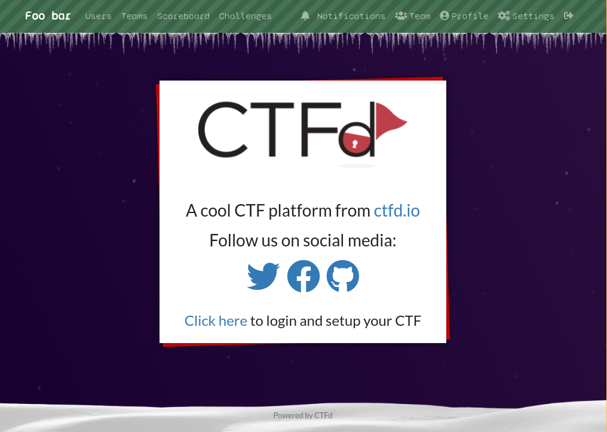
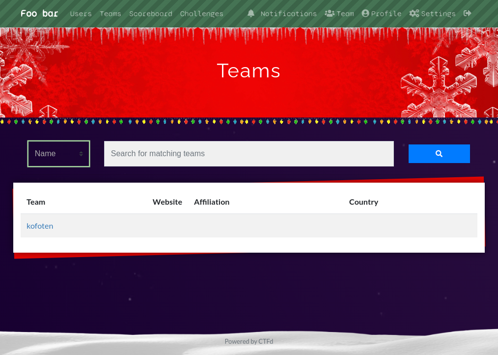

# CTFd Christmas theme





## Compatible with: CTFd v3.4.0

May or may not support older versions. Has only been battle tested with CTFd
v3.4.0, so use it with versions such as CTFd v3.3.0 at your own risk, but using
it with CTFd v2.x.x will probably break things.

## Install

Clone this repo inside the `themes` directory of your CTFd instance.
For example:

```sh
git clone https://github.com/iver-ics/CTFd-xmas-theme.git CTFd/themes/xmas
```

Then inside the "Config" section of your admin panel, chose the `xmas` theme
from the "Theme" configuration.


## License

This project is owned and maintained by Iver and is licensed under the MIT
license. See [LICENSE](./LICENSE) for full license text.